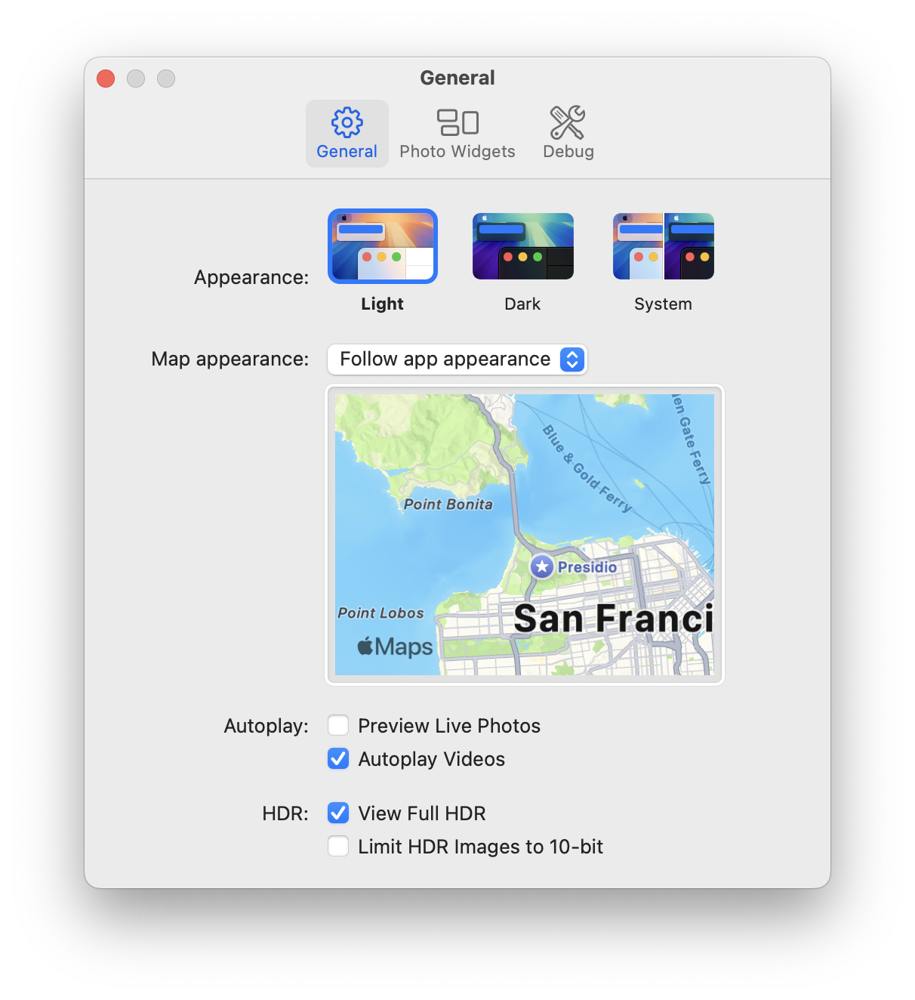
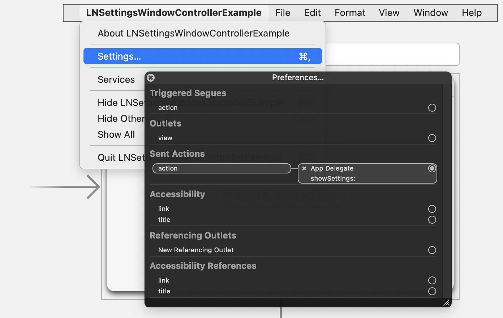

# LNSettingsWindowController

`LNSettingsWindowController` is an `NSWindowController` subclass that manages your custom view controllers for handling app settings.

<p align="center"><picture><source srcset="./Supplements/Settings.png" media="(prefers-color-scheme: light)" width="606"/><source srcset="./Supplements/Settings-Dark.png"  media="(prefers-color-scheme: dark) width="606""/></picture></p>

## Adding to Your Project

### Swift Package Manager

`LNPopupUI` supports Swift tools versions 6.0 (Xcode 16) and above. In Xcode, click `File` -> `Swift Packages` -> `Add Package Dependency`, enter `https://github.com/LeoNatan/LNSettingsWindowController`. Select the version you’d like to use.

You can also manually add the package to your Package.swift file:

```swift
.package(url: "https://github.com/LeoNatan/LNSettingsWindowController", from: "1.0")
```

And the dependency in your target:

```swift
.target(name: "BestExampleApp", dependencies: ["LNSettingsWindowController"]),
```

## Using the Library

### Project Integration

Import the module in your project:

```swift
import LNSettingsWindowController
```

### Settings Setup

```swift
// In AppDelegate:

let settingsController = LNSettingsWindowController()

@IBAction func showSettings(_ sender: Any) {
  settingsController.showSettingsWindow()
}

func applicationDidFinishLaunching(_ aNotification: Notification) {
  // Set the view controllers to display
  settingsController.viewControllers = [
    // ...
  ]
}
```

### Settings Controllers

Settings controllers must be `NSViewController` subclasses, implementing the `LNSettingsWindowControllerDataSource` protocol:

```swift
class GeneralSettingsController: NSViewController, LNSettingsWindowControllerDataSource {
	var settingsIdentifier: String {
		"general"
	}
	
	var settingsTitle: String {
		String(localized: "General")
	}
	
	var settingsToolbarIcon: NSImage {
		NSImage(systemSymbolName: "gearshape", accessibilityDescription: nil)!
	}
	
}
```

Finally, connect the `Settings…` menu item to the `showSettings(_:)` method:

<p align="center"></p>

## Acknowledgements

Originally based on [CCNPreferencesWindowController](https://github.com/emiscience/CCNPreferencesWindowController) 🙏
